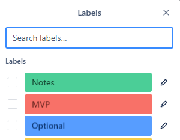
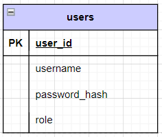

# Module Two final project

There are 2 options for the Module-2 final project:

1. Create and implement your own application. 
2. Implement an application from a Trello board project [here](https://trello.com/b/TFVG9ZUL/te-module2-final-project-board)

If a custom application was completed for the Module-2 mid-module project, that project can be extended and built upon for the Module-2 final project.

## Design Requirements

All applications must be accompanied by project design documents, charts, and/or diagrams.
 * Required design documents must be submitted along with the source code in the `/design` folder at the root of this project.
   * The database ERD can be placed in the `/database` folder.
 * Recommended design documents are optional.

### Required

* [**Custom project only**] Documentation of functional requirements to act as the application's Minimum Viable Product ([MVP](https://en.wikipedia.org/wiki/Minimum_viable_product)).
  * A functional requirement describes what the application can do or provide from a user's perspective.
  * Functional requirements can be encapsulated into a *[user story](https://en.wikipedia.org/wiki/User_story)*. For example,
    * "As an unauthenticated user, I can review a list of products for sale."
    * "As an authenticated user, I can clear my cart, removing all items from the cart."
  * At least 1 functional requirement must include the use of authentication
* Database ERD diagram
    * Must include at least 1 table in addition to the provided users table
    * Table columns
    * Table relationships
    * Table constraints
* API endpoint design
    * Endpoints listing HTTP method and URL
    * Indicate any path variables or query parameters
    * Indicate if the endpoint requires authentication and/or authorization roles
    * Success and error status codes for endpoints
    * Any JSON request and/or response body schemas

Below is an example of API endpoint design table:

| Endpoint              | Method | Query Parameters                        | Description                   | Success | Error    | Authentication   |
|:----------------------|:------:|:----------------------------------------|:------------------------------|:-------:|:---------|:-----------------|
| /api/reservation      |  GET   | dateto, optional datefrom, optional | Get all reservations          |   200   | 400      | None             |
| /api/reservation      |  POST  | None                                    | Create a new reservation      |   201   | 400, 422 | Required         | 
| /api/reservation/{id} |  GET   | None                                    | Get a specific reservation    |   200   | 404      | Creator or ADMIN |
| /api/reservation/{id} |  PUT   | None                                    | Update a specific reservation |   200   | 404, 409 | Creator or ADMIN |
| /api/reservation/{id} | DELETE | None                                    | Delete a specific reservation |   204   | 404      | ADMIN            |

### Recommended

* Class summaries
  * Instance variables
  * public methods
  * Inheritance or interface relationships
  * Examples:
    * DAO interfaces with method descriptions
    * Model classes
      * DTO @valid checks
    * Service classes
* Flow charts or [Sequence diagrams](https://en.wikipedia.org/wiki/Sequence_diagram)
  * Summarize end-to-end HTTP request to HTTP response for API endpoints
* Database Integration Test Plan
  * Happy Path test cases
  * Corner cases
  * Success criteria
  * Mock users and/or mock test data

## Creating or Extending your own Application

If you decide to create your own application or extend upon your mid-module project, **please confirm your Application proposal with your instructor.**

### Custom Project Requirements

The following are the minimum requirements your application must include:

* Documentation of at least 5 functional requirements
  * At least one requirement must include an authenticated user. 
  * The provided login and registration flow **can not** be used as one of the 5 functional requirements.
  * Requirements utilizing the methods from the provided `userDao` class **can not** be used as one of the 5 minimum functional requirements.
* Must use the tech stack used in class, namely Spring Boot and Postgres, to create a backend web service.
* A REST API with appropriate, authenticated endpoints.
* Postgres database access via DAO pattern.
* A SQL script to create tables and any mock data.
* Using an external API is not required, but highly recommended.
* A clear purpose, function, or utility.

## Creating an Application from a Trello Board Project

[Trello Board projects](https://trello.com/b/SHSRQCza/te-module2-final-projects) contain *[user story](https://en.wikipedia.org/wiki/User_story)* cards, which act as the project's functional requirements.
Each card in a Trello Board is color coded with a green, red, or blue label.
 * Green label - Information only, no work needs to be done.
 * Red label - A user story that is a part of the minimum requirements to complete the project. These user stories must all be implemented to achieve a Minimum Viable Product ([MVP](https://en.wikipedia.org/wiki/Minimum_viable_product)).
 * Blue or Orange label - A user story that is optional and should only be completed *after* completing all the MVP (red) user stories.

Below is an example from the City Tours project: 

 

### Trello Project Requirements

The following are the minimum requirements your application must include:

* Must use the tech stack used in class, namely Spring Boot and Postgres to create a backend web service.
* A REST API with appropriate, authenticated endpoints.
* Postgres database access via DAO pattern.
* A SQL script to create tables and any mock data.
* Using an external API is not required, but highly recommended.
* Complete all, or at least 5, of the MVP (red) User Stories

## Database Setup

To run the application, you must first create the `m2_final_project` database. Then run the `database/m2_final_project.sql` script to create the user table with some test users.

> Note: The script creates two users for testing, `user` and `admin`, which both have the password: `password`.

## Running the Starter Code

Use the code in this project as the starter code for your project.
After setting up the database, run the application from the Application class. There should be no errors.

Import the `/postman/M2-Final_Project.postman_collection.json` into Postman as a collection.
Open the Login and Register requests and test they work.
